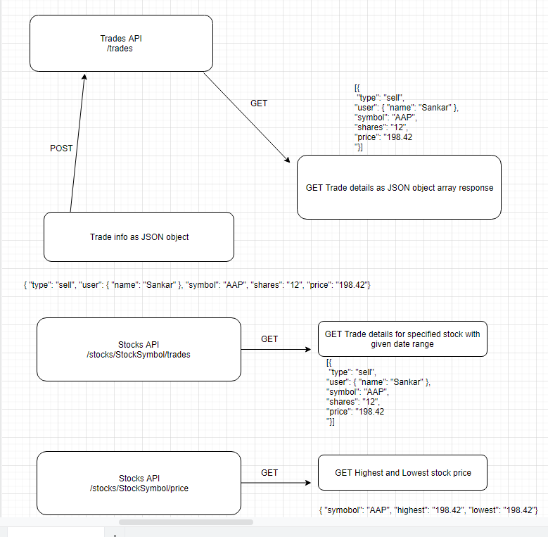
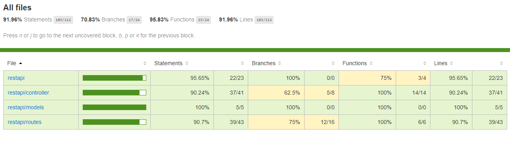

# Rest API for Trading management platform

Class Diagram

API Documentation:

Erase all trades: DELETE http://localhost:3000/trades/erase

Add new trades: POST http://localhost:3000/trades
Input:
{
	"type": "sell",
	"user": {
		"name": "Sankar"
	},
	"symbol": "AAP", // Allowed symbols : 'AAN', 'AAP', 'ABB', 'ABM', 'ACM'
	"shares": "12",
	"price": "198.42"
}

GET all trades: GET http://localhost:3000/trades

GET trades by user id: GET http://localhost:3000/trades/user/:id

GET trade records filtered by the stock symbol and trade type: 
GET http://localhost:3000/stocks/AAP/trades?type=buy&start=2019-12-23&end=2019-12-24

GET the highest and lowest price for the stock symbol:
GET http://localhost:3000/stocks/AAP/price?start=2019-12-23&end=2019-12-24

Instruction to install and build

$ git clone https://github.com/Sankara-Dev/restapi.git
$ cd restapi
$ npm install
$ nodemon

Run Test

$ npm run coverage

